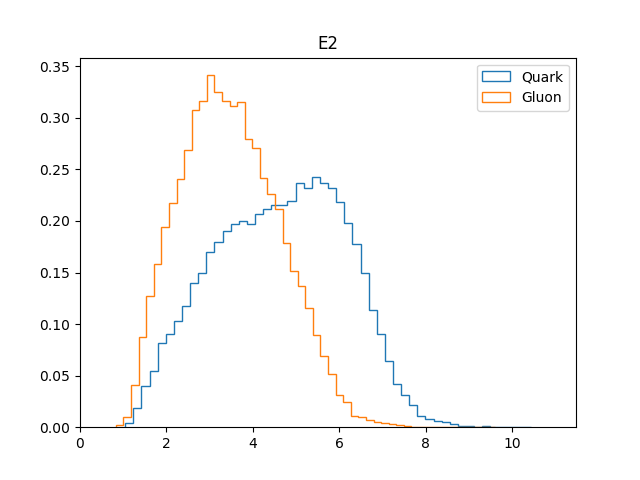
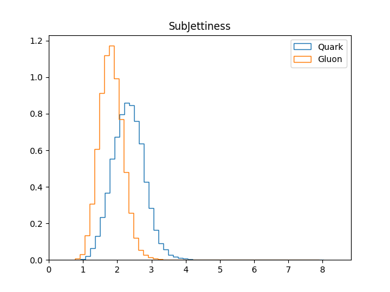
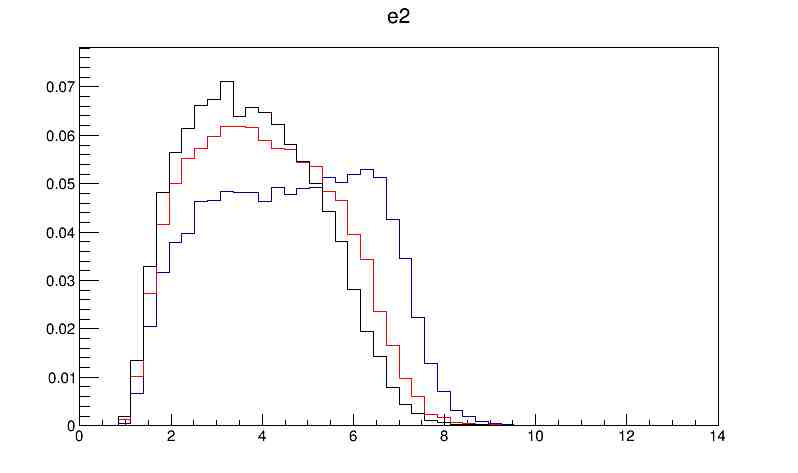

# Pythia Settings
 The processes chosen were 

and,

More details on the settings can be seen 
Number of Events = 10000
# FastJet Settings
These plots were produced after the events are generated in pythia and then
clustered into jets using anti-kt algorithm using E-Scheme
## Grooming
   The jets were groomed using Soft-Drop algorithm

## E_2
  This was the formula used for the Calculating e2
  

Where,

Reference for the formula of e_2 [[https://arxiv.org/pdf/1704.03878.pdf]]

## Girth
 The Formula for Girth

We can see this is the same as the formula for e_alpha with alpha = 1 and R = 1

## Tau
 Tau was calcualted using the routine from fastjet contrib

# Plots

 For all the plots the are plotted in a logarithmic scale

For all the Plots the blue lines represent the Gluons and the Red lines represent the Quarks
## Reclustering after softdrop with the defafault CA Algo

### E2

### Girth

### SubJettiness
Normalized with Jet size of 0.6 and Beta = 0.5

## Varying the Value of Alpha_S in timelike showers 

For the Blue Lines Alpha_S = 0.1

For the Red Lines Alpha_S = 0.1383

For the Black Lines Alpha_S = 0.16
### Quarks

### Gluons

# LOG
I have created a file called  . Progress will be updated there.
