# Pythia Settings
 The processes chosen were 

and,

More details on the settings can be seen 
Number of Events = 10000
# FastJet Settings
These plots were produced after the events are generated in pythia and then
clustered into jets using anti-kt algorithm using E-Scheme
# Jet Variables
## Grooming
   The jets were groomed using Soft-Drop algorithm

### E_2
  This was the formula used for the Calculating e2
  

Where,

Reference for the formula of e_2 [[https://arxiv.org/pdf/1704.03878.pdf]]

### Girth
 The Formula for Girth

We can see this is the same as the formula for e_alpha with alpha = 1 and R = 1

### Subjettiness
 Tau was calcualted using the routine from fastjet contrib
Subjettiness Normalized with Jet size of 0.6 and Beta = 0.5

### Mass of the Jet
### Count
  Number of Constituent tracks in the Jet
### Two Point Moment

# Plots

 For all the plots the are plotted in a logarithmic scale

## Varying the Value of Alpha_S in timelike showers 

For the Blue Lines Alpha_S = 0.1

For the Red Lines Alpha_S = 0.1383

For the Black Lines Alpha_S = 0.16
### Quarks

### Gluons

# Classification
For all the Plots the blue lines represent the Gluons and the Red lines represent the Quarks
Reclustering after softdrop with the defafault CA Algo

Now, Based on these Jet Variables, We try to calculate a gluon Jet and a Quark jet. The ROC Curve for such a classification is as follows

# JetImages
Jet Images were created based on references from these papers (https://arxiv.org/abs/1511.05190) and (https://arxiv.org/abs/1407.5675)

Seen below are the JetImages for Quark and Gluons. These images are pre-processed in such a way that the hardest jet is always centered to the center.
If we look at the JetImages below we see that the jets for gluons are broader than the jets for quarks. 
We knew this from the physics variables such as girth which were related to the radial moments of the jets

The JetImages seen below are average jet images over all the events.
For various parameters in the SoftDrop algorithm
### z_cut = 0.2 beta = 2

#### Jet Image

#### Convolutional Neural Netowork

#### MaxOut FC Neural Netowrk

#### ReLU FC Neural Network
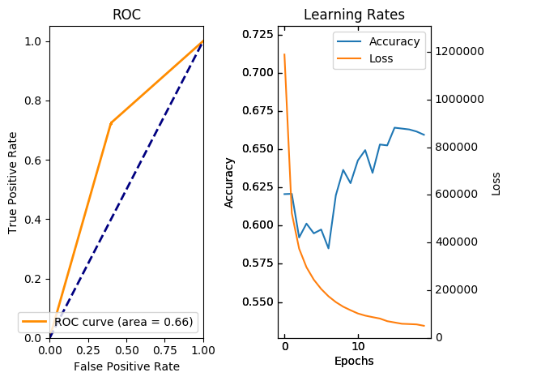

### z_cut = 0.1 beta = 2
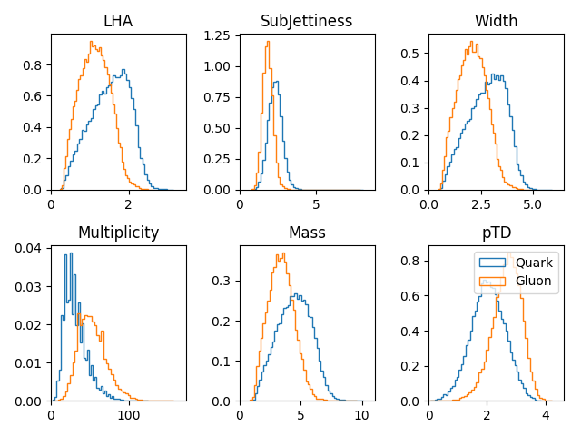
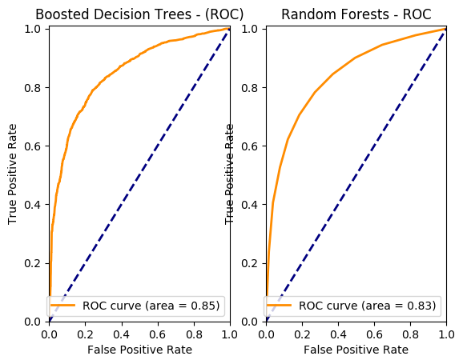
#### Jet Image

#### Convolutional Neural Netowork

#### MaxOut FC Neural Netowrk

#### ReLU FC Neural Network

### z_cut = 0.05 beta = 2
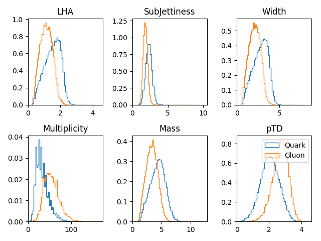
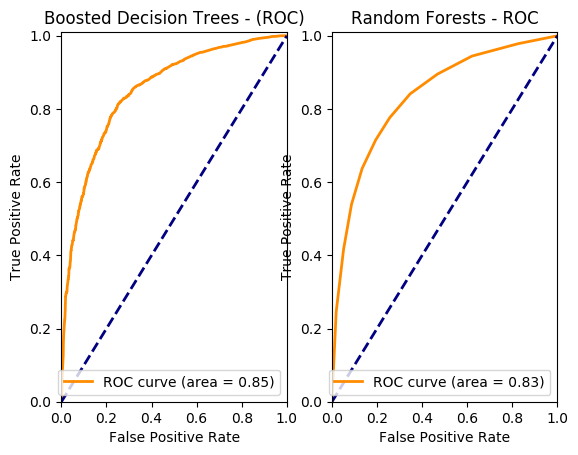
#### Jet Image

#### Convolutional Neural Netowork

#### MaxOut FC Neural Netowrk

#### ReLU FC Neural Network

### z_cut = 0.2 beta = 1
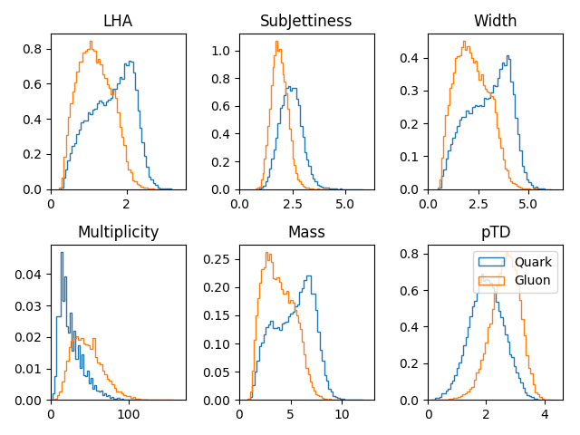

#### Jet Image

#### Convolutional Neural Netowork

#### MaxOut FC Neural Netowrk

#### ReLU FC Neural Network

### z_cut = 0.1 beta = 1

#### Jet Image

#### Convolutional Neural Netowork

#### MaxOut FC Neural Netowrk
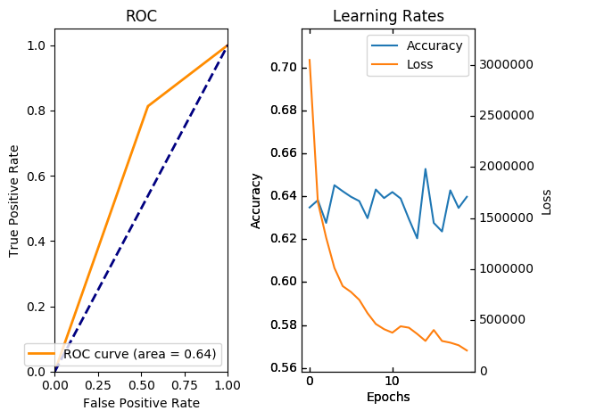
#### ReLU FC Neural Network

### z_cut = 0.05 beta = 1
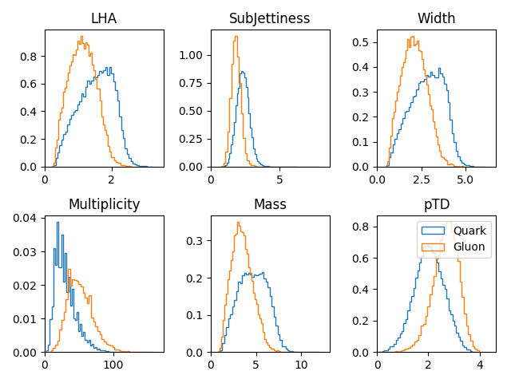

#### Jet Image

#### Convolutional Neural Netowork

#### MaxOut FC Neural Netowrk

#### ReLU FC Neural Network

### z_cut = 0.2 beta = 0

#### Jet Image
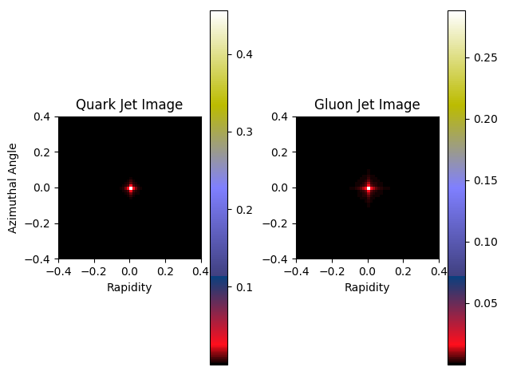
#### Convolutional Neural Netowork

#### MaxOut FC Neural Netowrk

#### ReLU FC Neural Network

### z_cut = 0.1 beta = 0
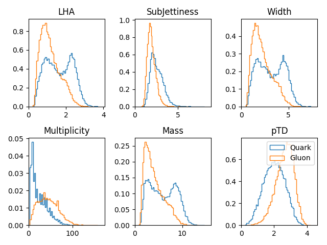

#### Jet Image
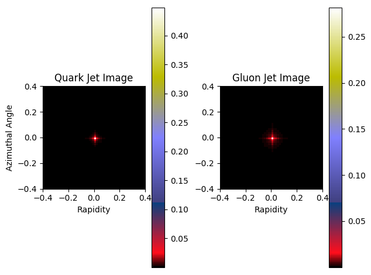
#### Convolutional Neural Netowork

#### MaxOut FC Neural Netowrk

#### ReLU FC Neural Network

### z_cut = 0.05 beta = 0

#### Jet Image
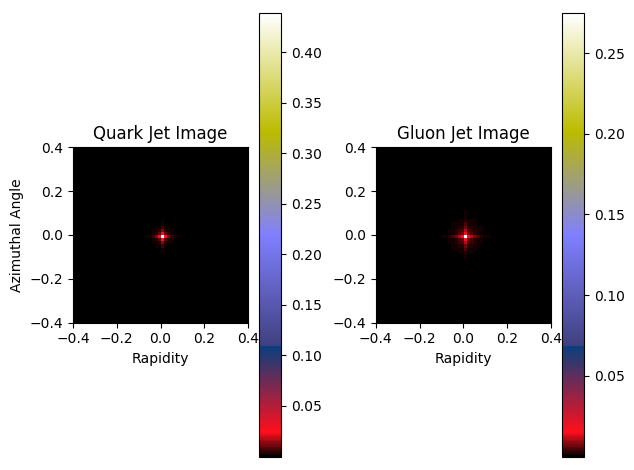
#### Convolutional Neural Netowork

#### MaxOut FC Neural Netowrk

#### ReLU FC Neural Network

## Plotting with the Ecal data 
Muons are elimated from the EFLowTracker based on PID
Better way will be made available soon as muon discrimation is done in Delphes
### E2
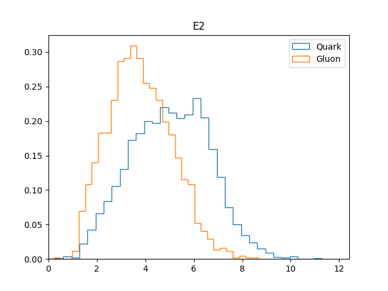
### Girth 
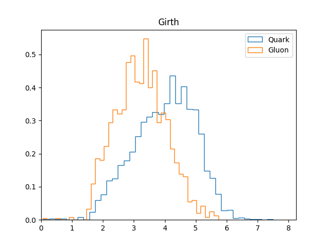
### Subjettiness
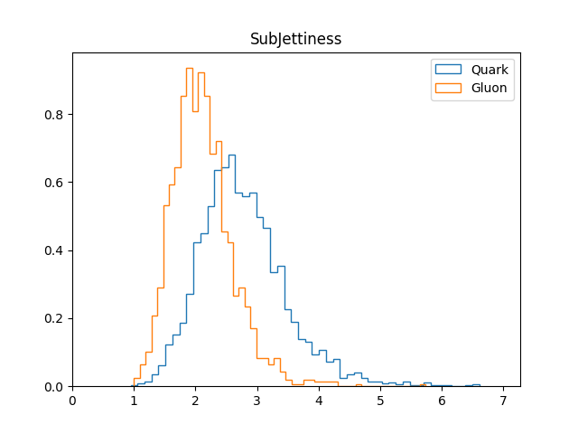

# Classification

## Random Forests
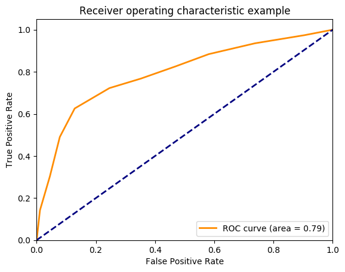

## Boosted Decision Trees

# JetImages

# Neural Network Classification
Based on the JetImages provided above a neural network was employed to classify the images into 2 categories 
## CNN Network

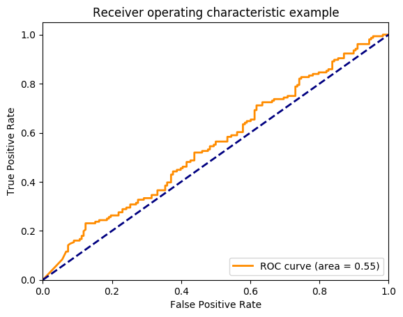
Now, If we Look at the Learning rates of the Network. By Plotting the Accuracy and the Loss with respect to the number of Epochs

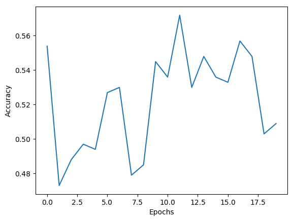
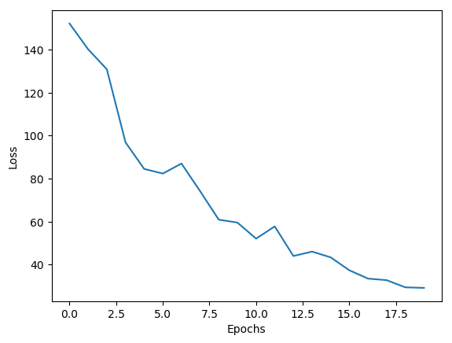
## FCC
### MaxOut

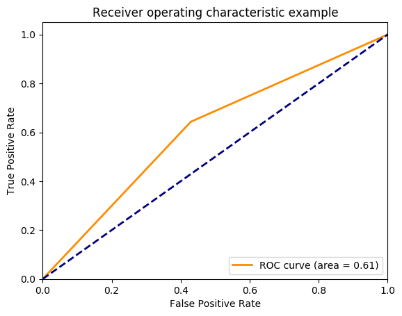
Learning Rates

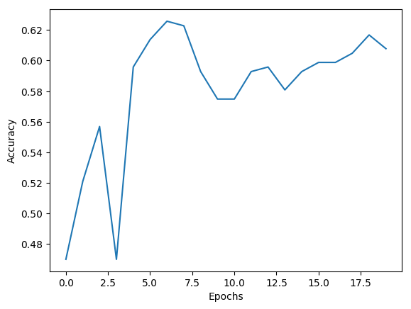
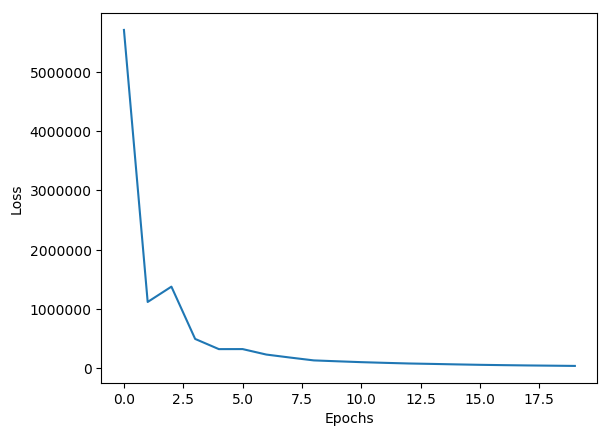
### ReLU
and a Fully connected network with ReLU activation neural network got an accuracy of 66.7311%

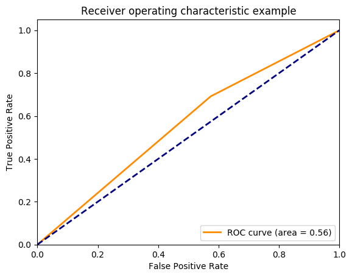

Learning Rates

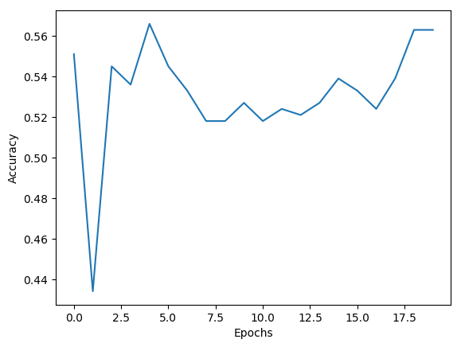
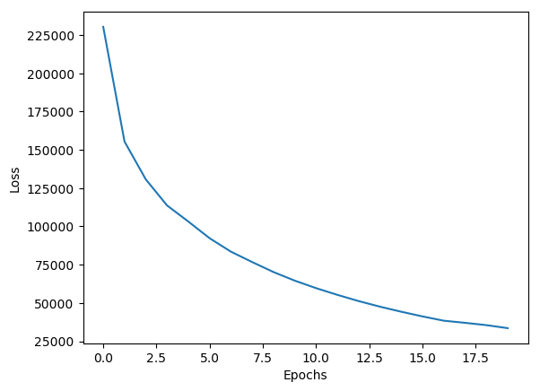

Now, I have to try to optimize the Hyper Parameters based on Validation sets

# LOG
I have created a file called  . Progress will be updated there.
